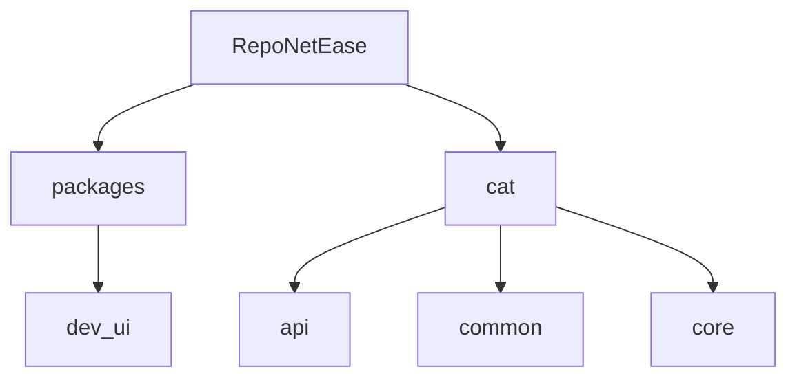
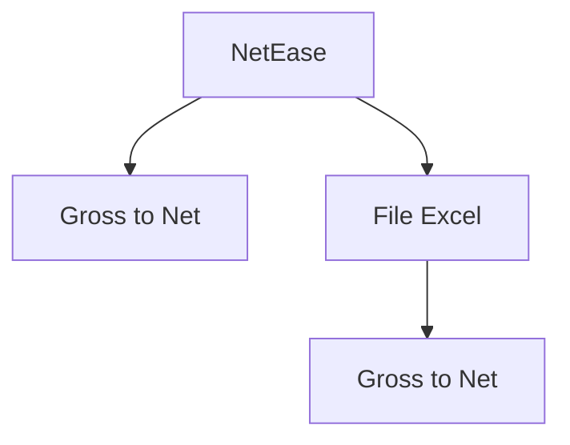

# NetEase - Repo

NetEase is an application that helps calculate Net salary from Gross salary and allows
uploading Excel files for automatic salary calculations.

Features:

✅ Convert Gross salary to Net salary based on standard formulas

✅ Upload Excel files for batch salary processing

✅ Simple and user-friendly interface

## Structure

- `Monorepo`



- `cat`



## Development

### Prerequisites

- `uv` - for Python dependency management
- `just` - for running project-specific commands
- `watchexec` - for automatically re-running tests when code changes

You can install them by running the following commands in Terminal:

- On Windows:

```powershell
# 1. Install winget
Add-AppxPackage -RegisterByFamilyName -MainPackage Microsoft.DesktopAppInstaller_8wekyb3d8bbwe

# 2. Install `mise` for managing dev tools
winget install jdx.mise --source winget

# 3. Activate mise
## 3.1. Create personal Powershell profile script file if not exists

if (!(Test-Path -Path $PROFILE)) {
  New-Item -ItemType File -Path $PROFILE -Force
}

## 3.2 Open the script file

code $profile

## 3.3 Copy and paste the following 4 lines to the opened script file

$shimPath = "$env:USERPROFILE\AppData\Local\mise\shims"
$currentPath = [Environment]::GetEnvironmentVariable('Path', 'User')
$newPath = $currentPath + ";" + $shimPath
[Environment]::SetEnvironmentVariable('Path', $newPath, 'User')

# 4. Restart your terminal

# 5. Install `uv`, `just` and `watchexec`
mise use -g ubi:astral-sh/uv just watchexec
```

- On WSL:

```sh
# 1. Install `mise` for managing dev tools
wget -O - https://github.com/jdx/mise/releases/download/v2025.1.6/install.sh | sh

# 2. Activate mise
echo 'eval "$(~/.local/bin/mise activate bash)"' >> ~/.bashrc

# 3. Restart your terminal

# 4 Install `uv` and `just`
mise use -g uv just watchexec
```

### Installation

- Set up virtual environment, install dependencies and pre-commit:

  ```sh
  just install
  ```

- Run `just` to see other supported commands.

  ```sh
  just upgrade # Update all dependeinces
  just format # Auto-format source files
  just lint # Lint Python source files
  just typecheck # Perform type-checking
  just test # Run all tests
  just watch # Watch and re-run all tests when code changes
  ```

## Run NetEase service

## Solution 1:

### 1, Create and use enviroment

```
uv sync --all-packages        # Create enviroment
source .venv/bin/activate     # Activate enviroment
```

### 2, Backend: Run FastAPI -> <http://localhost:8888>

```
python src/cat/api/main.py
```

### 3, Frontend: Run Streamlit -> <http://localhost:8501>

```
streamlit run packages/dev_ui/src/dev_ui/ui/Homepage.py
```

## Solution 2:

### 1, Create and use enviroment

```
python -m venv .venv          # Create enviroment

source .venv/bin/activate     # Activate enviroment for Unbuntu
.venv\Scripts\Activate        # Activate enviroment for Windows
```

### 2, Install library

```
pip install -e packages/dev_ui
pip install -e .
```

### 3, Backend: Run FastAPI -> <http://localhost:8888>

```
python src/cat/api/main.py
```

### 4, Frontend: Run Streamlit -> <http://localhost:8501>

```
streamlit run packages/dev_ui/src/dev_ui/ui/Homepage.py
```
